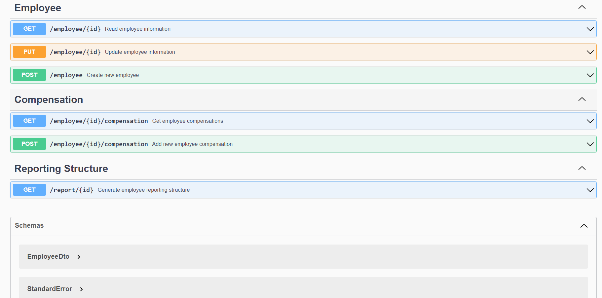

[](https://github.com/ricardoianelli/m-code-challenge/actions/workflows/gradle.yml)

<h1 align="center">
   💻 Code Challenge - Company M. 💻
</h1>
<h3 align="center">
    Candidate: Ricardo Ianelli
</h3>

## #️⃣ Glossary #️⃣
- [About](#-about-)
- [The Challenge](#-the-challenge-)
  - [How to Use](#how-to-use)
  - [Task 1](#task-1)
  - [Task 2](#task-2)
- [About the solution](#-about-the-solution-)
- [Running it](#-running-it-)
- [Tasks Backlog](#-tasks-backlog-)

## 📚 About 📚
A technical challenge involving employees management scenarios.
You have options to:

- Read and create employees
- Generate reporting structure to see who reports to a certain employee
- Read and create employee compensations

Using RESTful API's made available with Java and Spring Boot.
The database is a MongoDB running embedded, though the solution was created flexibly enought to change to another type of database without any big trouble.

### 🔥 The Challenge 🔥

A simple [Spring Boot](https://projects.spring.io/spring-boot/) web application has been created and bootstrapped 
with data. The application contains information about all employees at a company. On application start-up, an in-memory 
Mongo database is bootstrapped with a serialized snapshot of the database. While the application runs, the data may be
accessed and mutated in the database without impacting the snapshot.

### Task 1
Create a new type, ReportingStructure, that has two properties: employee and numberOfReports.

For the field "numberOfReports", this should equal the total number of reports under a given employee. The number of 
reports is determined to be the number of directReports for an employee and all of their distinct reports. For example, 
given the following employee structure:
```
                    John Lennon
                /               \
         Paul McCartney         Ringo Starr
                               /        \
                          Pete Best     George Harrison
```
The numberOfReports for employee John Lennon (employeeId: 16a596ae-edd3-4847-99fe-c4518e82c86f) would be equal to 4. 

This new type should have a new REST endpoint created for it. This new endpoint should accept an employeeId and return 
the fully filled out ReportingStructure for the specified employeeId. The values should be computed on the fly and will 
not be persisted.

### Task 2
Create a new type, Compensation. A Compensation has the following fields: employee, salary, and effectiveDate. Create 
two new Compensation REST endpoints. One to create and one to read by employeeId. These should persist and query the 
Compensation from the persistence layer.


## ⭐ About the solution ⭐

At first I took a look at the source code to understand the current architecture. 
After that, I've created a basic diagram representation of this architecture and saw potential issues in there (coupling, etc).
With that, I started constructing the [Tasks Backlog](#-tasks-backlog-) and taking the tasks in the prioritized order.

Since I wanted to do TDD (Test Driven Development), I decided to start creating unit tests for the existing controller and service, so that I could feel more confortable to refactor the code and then implement the requested features.

After this initial tests creation, I've created tests for an EmployeeDto and EmployeeAdapter classes, and after that I started the creation of the actual EmployeeDto and EmployeeAdapter, responsible to decouple the domain from external clients and give more flexibility during the lifetime of the project, and was safe since I had tests to back me up during the entire process.

I also created a Postman collection and kept it always updated here in the repository as well, so that people can use it  for an easier experience.

Thinking about the tasks took most of the time, since for me they were really open. What is a Compensation? Is it a fixed, one-to-one with employee telling his curret salary, or it's something used to store each payment this employee gets? I went for the second option in the middle of the way, so it took me more refactoring.

I also wanted to include some extra features like automated endpoint documentation with Swagger/OpenAPI, validations, pagination to the compensations READ endpoint, CI with GitHub Actions (it's building and testing the code on every push) and a requests logger that informs the URI, HTTP method and duration of each request on every endpoint in the application.

I wanted to include more extra things like JWT authentication and authorization, create a Dockerfile for the application and host a live version of it on AWS, but I'll probably do it in the future, mainly for fun and continuous improvement.

Overall it was a very fun challenge that I could have finished within few minutes or hours if I didn't care about quality so much, but since I didn't had a deadline, I took my time to do the best I could given my actual conditions. (I got a severe torticollis in the day I started this, that slowed me down a lot)

## 🏛️ Architecture 🏛️

This application offers a RESTful API using a layered architecture and a single document database (NoSQL) as persistance.
Here's a simple overview diagram of the application (showing only the most important aspects):


## 🚀 Running it 🚀
- The application may be executed by running `gradlew bootRun`.

## 📧 Endpoints 📧

You can access the API documentation going to: http://localhost:8080/swagger-ui/index.html
Note that you need to be running the service for that, of course.
In there you can find a description of every endpoint offered and how to use it.


## 🚧 Tasks Backlog 🚧
#### Core:
- [x] Create unit tests for EmployeeController methods
- [x] Create unit tests for EmployeeServiceImpl
- [x] Refactor controller to respect REST best practices
- [x] Use DTOs to avoid coupling
- [x] Create Adapter tests and implementation
- [x] Add Postman Collection
- [x] Add application design overview
- [x] Create ReportingStructure tests
- [x] Create ReportingStructure DTO
- [x] Create ReportingStructure DTO service tests
- [x] Create ReportingStructure DTO service
- [x] Create ReportingStructure DTO controller tests
- [x] Create ReportingStructure DTO controller
- [x] Add unit tests for existing JsonMapper
- [x] Create Compensation entity
- [x] Create Compensation repository
- [x] Create Compensation DTO
- [x] Create CompensationAdapter tests
- [x] Create CompensationAdapter implementation
- [x] Create Compensations DTO
- [x] Create Compensation service tests
- [x] Create Compensation service implementation
- [x] Create Compensation controller tests
- [x] Create Compensation controller
- [x] Include CI with GitHub actions (Build+Tests)
- [x] Add Swagger API documentation
- [x] Add request logging with duration, status code and URI
- [x] Add validations to DTOs
- [x] Paginate Compensation read endpoint

#### To the future:
- [ ] Implement security using JWT
- [ ] Dockerize application
- [ ] Host live demo on AWS
