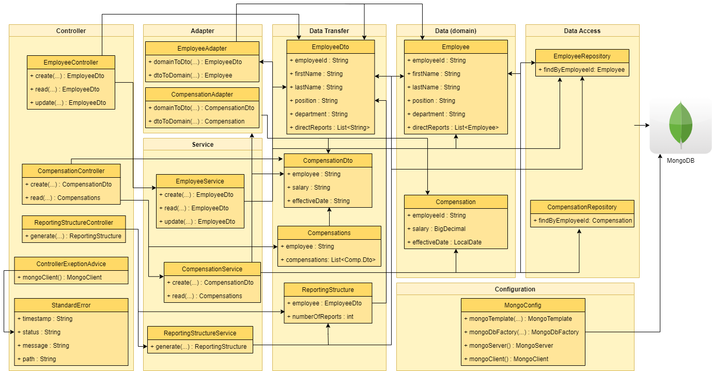

<h1 align="center">
    Code Challenge - Company M.
</h1>
<h3 align="center">
    Candidate: Ricardo Ianelli
</h3>

## #️⃣ Glossary #️⃣
- [About](#-about-)
- [The Challenge](#-the-challenge-)
  - [How to Use](#how-to-use)
  - [Task 1](#task-1)
  - [Task 2](#task-2)
- [About the solution](#-about-the-solution-)
- [Running it](#-running-it-)
- [Tasks Backlog](#-tasks-backlog-)

## 📚 About 📚
This is the code challenge given during an interview process for a company M.

### 🔥 The Challenge 🔥

A simple [Spring Boot](https://projects.spring.io/spring-boot/) web application has been created and bootstrapped 
with data. The application contains information about all employees at a company. On application start-up, an in-memory 
Mongo database is bootstrapped with a serialized snapshot of the database. While the application runs, the data may be
accessed and mutated in the database without impacting the snapshot.

### How to Use
The following endpoints are available to use:
```
* CREATE
    * HTTP Method: POST 
    * URL: localhost:8080/employee
    * PAYLOAD: Employee
    * RESPONSE: Employee
* READ
    * HTTP Method: GET 
    * URL: localhost:8080/employee/{id}
    * RESPONSE: Employee
* UPDATE
    * HTTP Method: PUT 
    * URL: localhost:8080/employee/{id}
    * PAYLOAD: Employee
    * RESPONSE: Employee
```
The Employee has a JSON schema of:
```json
{
  "type":"Employee",
  "properties": {
    "employeeId": {
      "type": "string"
    },
    "firstName": {
      "type": "string"
    },
    "lastName": {
          "type": "string"
    },
    "position": {
          "type": "string"
    },
    "department": {
          "type": "string"
    },
    "directReports": {
      "type": "array",
      "items" : "string"
    }
  }
}
```
For all endpoints that require an "id" in the URL, this is the "employeeId" field.

### Task 1
Create a new type, ReportingStructure, that has two properties: employee and numberOfReports.

For the field "numberOfReports", this should equal the total number of reports under a given employee. The number of 
reports is determined to be the number of directReports for an employee and all of their distinct reports. For example, 
given the following employee structure:
```
                    John Lennon
                /               \
         Paul McCartney         Ringo Starr
                               /        \
                          Pete Best     George Harrison
```
The numberOfReports for employee John Lennon (employeeId: 16a596ae-edd3-4847-99fe-c4518e82c86f) would be equal to 4. 

This new type should have a new REST endpoint created for it. This new endpoint should accept an employeeId and return 
the fully filled out ReportingStructure for the specified employeeId. The values should be computed on the fly and will 
not be persisted.

### Task 2
Create a new type, Compensation. A Compensation has the following fields: employee, salary, and effectiveDate. Create 
two new Compensation REST endpoints. One to create and one to read by employeeId. These should persist and query the 
Compensation from the persistence layer.


## ⭐ About the solution ⭐

At first I took a look at the source code to understand the current architecture. 
After that, I've created a basic diagram representation of this architecture and saw potential issues in there (coupling, etc).
With that, I started constructing the [Tasks Backlog](#-tasks-backlog-) and taking the tasks in the prioritized order.

Since I wanted to do TDD (Test Driven Development), I decided to start creating unit tests for the existing controller and service, so that I could feel more confortable to refactor the code and then implement the requested features.

After this initial tests creation, I've created tests for an EmployeeDto and EmployeeAdapter classes, and after that I started the creation of the actual EmployeeDto and EmployeeAdapter, responsible to decouple the domain from external clients and give more flexibility during the lifetime of the project, and was safe since I had tests to back me up during the entire process.

There's also a Postman collection to make it easier to test the web api's.


## 🏛️ Architecture 🏛️

This application offers a RESTful API using a layered architecture and a single document database (NoSQL) as persistance.
Here's a simple overview diagram of the application (showing only the most important aspects):


## 🚀 Running it 🚀
- The application may be executed by running `gradlew bootRun`.

## 🚧 Tasks Backlog 🚧
- [x] Create unit tests for EmployeeController methods
- [x] Create unit tests for EmployeeServiceImpl
- [x] Refactor controller to respect REST best practices
- [x] Use DTOs to avoid coupling
- [x] Create Adapter tests and implementation
- [x] Add Postman Collection
- [x] Add application design overview
- [x] Create ReportingStructure DTO
- [x] Create ReportingStructure DTO service tests
- [x] Create ReportingStructure DTO service
- [ ] Create ReportingStructure DTO controller tests
- [ ] Create ReportingStructure DTO controller
- [ ] Add advice to log duration of requests
- [ ] Dockerize application
- [ ] Add Swagger API documentation
- [ ] Include CI with GitHub actions
